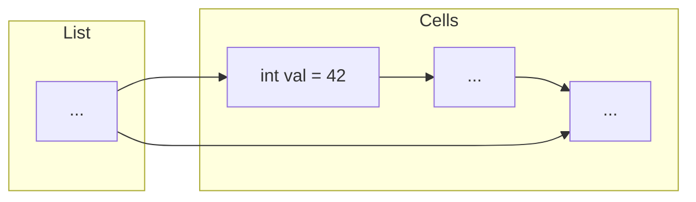

# Une première application des pointeurs : les listes différences

1. Position du problème
   On veut implanter les listes d'entiers avec la possibilité d'ajouts/suppressions **efficaces** d'éléments au début, à
   la
   fin et au milieu de la liste...

2. Principe de base

   Un élément de la liste est représenté par un objet de type `<<Cell>>`.

   Chaque cellule contient la valeur (ie un entier) que l'on veut stocker + un pointeur vers l'élément (ie la cellule)
   suivant(e)

   Pour manipuler une liste différence on se donne 2 pointeurs : un vers le premier élément de la liste et un deuxième
   vers le dernier élément.

   **Conseil** : Visualiser les listes en les dessinant avec des flèches (les pointeurs) qui relient des boîtes (les
   objets)

3. Des erreurs et du sucre syntaxique

    ```cpp
   Cell *ptr = new Cell(13); 
   //
   // ptr est un pointeur vers une cellule
   ```

   ```cpp
   cout << ptr.val;
   //
   // NON!
   ```

    ```cpp
   cout << *ptr.val;
   //
   // NON PLUS! L'étoile n'est pas prioritaire sur le point
   ```

   ```cpp
   cout << (*ptr).val;
   //
   // OK! Mais lourd et vite illisible
   ```

   ```cpp
   cout << ptr->val;
   //
   // LA bonne solution
   ```

**Résumé**, on accède aux membres d'un objet avec le point et aux membres d'un **pointeur** sur un objet avec la flèche.


